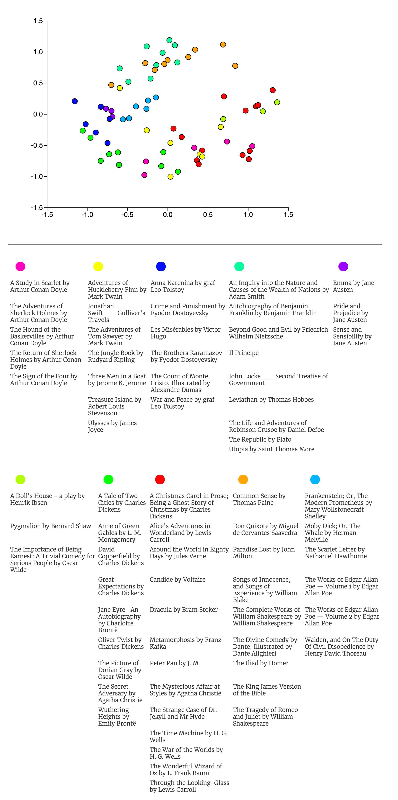

A bunch of scripts and modules used to generate clusters of documents using word2vec.
The results are described in [this post](https://jayantj.github.io/articles/2016/02/23/project-gutenberg-word2vec/).

A snapshot of the clusters created -

Right now, this is just a collection of haphazard scripts and modules, if anyone finds this useful, I could refactor it into something more usable.